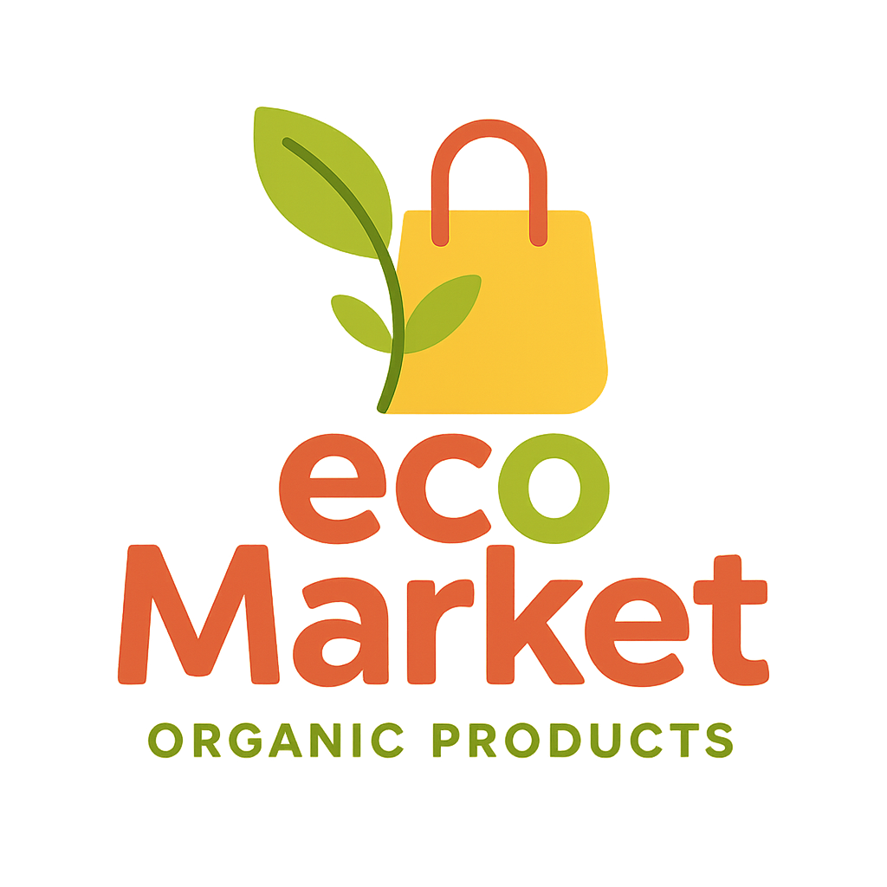
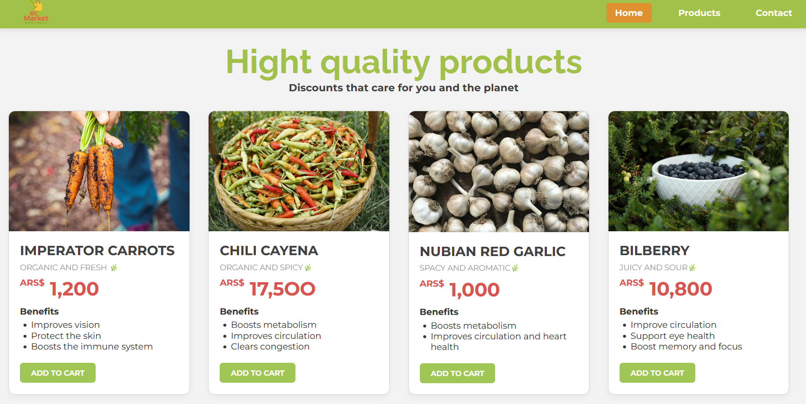

# EcoMarket 🌿

## About the project
EcoMarket is a static e-commerce website for organic products, developed as a personal project to practice and improve my frontend development skills. The page was built primarily with HTML and CSS, with some JavaScript used to add simple interactivity. It includes a landing page, a product browsing section, and a footer with basic information.

## 🍋Landing
The landing page features a navbar with a logo and navigation buttons. The main section includes a welcome message, highlights the store's benefits, and features a call-to-action button to browse our products.

## 🌿Products section
The product section includes a title and four cards, each displaying an image, a product name, and its price.

## 🚀 Technologies Used

