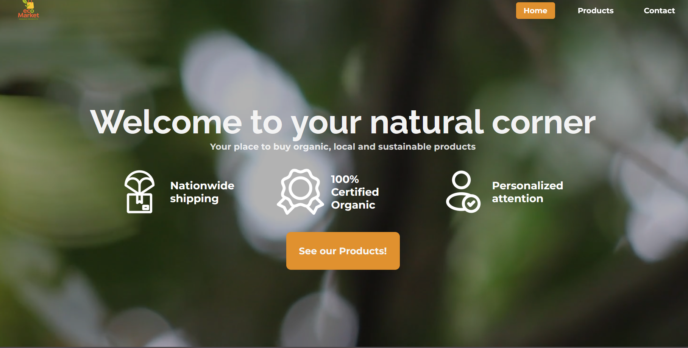

# EcoMarket

> 🚧 **This project is a work in progress.**  
> I'm actively developing new features and improvements. Some functionality may be incomplete or subject to change.

## About the proyect
EcoMarket is an e-commerce platform for organic products, developed as a personal project to practice and enhance my frontend development skills.
The website is simple and includes a landing page, a section to browse products, and a footer with basic information.

## Landing
The landing page features a navbar with a logo and navigation buttons. The main section includes a welcome message, highlights the store's benefits, and features a call-to-action button to browse our products.

## Products section
The product section includes a title and four cards, each displaying an image, a product name, and its price.

